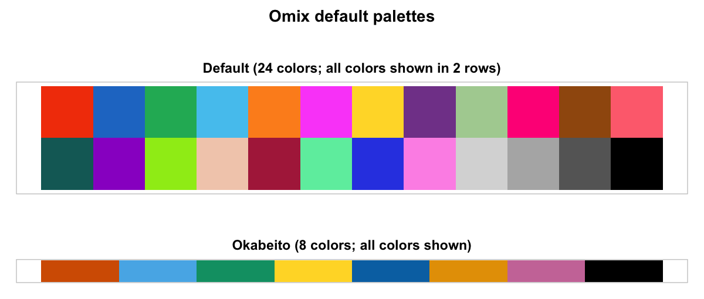
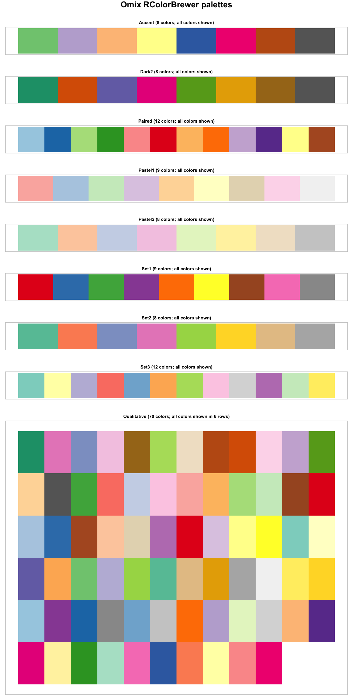
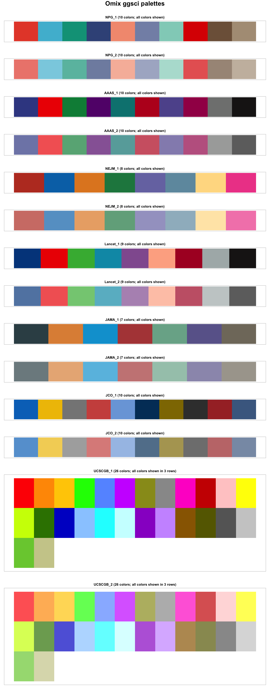

# Omix Core

`core/` is the reusable R package in the OMIX monorepo. It contains stable
utilities that can be shared by multiple analysis modules. The current public
API focuses on selecting, extending, and plotting color palettes.

## Install from GitHub

For analysis use, install the released core package directly from GitHub:

```r
install.packages("remotes")
remotes::install_github("NIDAP-Community/Omix", subdir = "core")

library(Omix)
```

`remotes` installs the package dependencies declared in `core/DESCRIPTION`.
This is the recommended path for analysts and for modules running outside a
local OMIX checkout. Access to a private repository requires GitHub
credentials configured in the R environment.

## Use from a module

After installing core, call its utilities with the `Omix::` namespace:

```r
sample_colors <- Omix::get_color_palette(
  num_col = 6
)
```

## Development setup

For contributors working inside a local OMIX checkout, load the package
without installing it:

```r
install.packages(c("colorspace", "ggsci", "RColorBrewer", "devtools"))
devtools::load_all("core")
```

Use this path while changing `core/`; analysis users should use the GitHub
installation above.

## Public utilities

| Utility | Use |
| --- | --- |
| `get_color_palette()` | Return exactly the requested number of colors, with optional plotting. |
| `get_colors()` | Return a palette plus its original size before extension. |
| `get_random_colors()` | Generate reproducible, visually distinct colors. |
| `get_hex_color()` | Convert named R colors to hexadecimal values. |
| `get_closest_color()` | Find the nearest named R color for a hex value. |
| `colorvect()` | Name a hex color vector with its closest R color names. |
| `plot_palette()` | Draw a supplied palette directly. |

## Get a palette

```r
colors <- get_color_palette(
  num_col = 8
)
```

`get_color_palette()` returns a character vector of colors. It preserves the source palette colors first, then generates extra colors when a larger palette
is requested.

```r
# Extend an eight-color palette to 40 colors reproducibly.
extended_colors <- get_color_palette(
  num_col = 40,
  sel_pal = "Dark2",
  seed = 10
)

# Use your own colors, extending them only when needed.
custom_colors <- get_color_palette(
  num_col = 6,
  use_custom_pal = TRUE,
  custom_pal = c("red", "blue", "gold"),
  seed = 10
)

# Display the selected palette as well as returning it.
visible_colors <- get_color_palette(
  num_col = 12,
  sel_pal = "Default",
  print = TRUE
)
```

The function signature is:

```r
get_color_palette(
  num_col = 10,
  sel_pal = "Default",
  use_custom_pal = FALSE,
  custom_pal = c(),
  split_pal_plot = TRUE,
  seed = 10,
  print = FALSE
)
```

### Default palette

`Default` is the recommended OMIX palette and is used when `sel_pal` is not
specified. Its 24 colors are shown in two strips in the gallery below.

Its 20 non-neutral colors were created with **Colorgorical**, a Brown
University Visualization Research Lab tool for generating categorical palettes
with attention to perceptual discriminability and visual preference. The final
four greys provide neutral and contrast options. This supports discrimination
for typical color vision, but it is not a replacement for a color-vision
accessibility check; use `Okabeito` when that is the primary requirement.
Reference: Gramazio, C. C., Laidlaw, D. H., & Schloss, K. B. (2017).
*Colorgorical: Creating discriminable and preferable color palettes for
information visualization.* IEEE Transactions on Visualization and Computer
Graphics, 23(1), 521–530. <https://doi.org/10.1109/TVCG.2016.2598918>

Palette functions return a **named** hex vector. For every returned color, the
name is the closest base R color name, making it easier to select and discuss
colors in R; the hex value is always the exact color used. For example,
`default_colors["dodgerblue3"]` returns the exact OMIX hex value, not R's
`dodgerblue3` RGB value.

The 24 highlighted Default-palette labels are:

`orangered2`, `dodgerblue3`, `mediumseagreen`, `steelblue1`, `chocolate1`,
`mediumorchid1`, `goldenrod1`, `orchid4`, `darkseagreen3`, `deeppink`,
`darkgoldenrod4`, `salmon`, `deepskyblue4`, `darkviolet`, `greenyellow`,
`bisque2`, `maroon`, `aquamarine2`, `royalblue3`, `violet`, `gray85`,
`gray70`, `gray40`, and `black`.

```r
default_colors <- get_color_palette(num_col = 24)
default_colors
```

To select a non-default palette, specify its name with `sel_pal`. For example,
this selects the 10-color `ggsci` NPG palette:

```r
npg_colors <- get_color_palette(
  num_col = 10,
  sel_pal = "NPG_1"
)
```

## Inspect and reuse colors

```r
palette_info <- get_colors(num_col = 10, sel_pal = "Default")
palette_info$colors
palette_info$palette_size

get_hex_color(c("red", "steelblue"))
get_closest_color("#1B9E77")
plot_palette(colors, n_colors = length(colors), split_columns = TRUE)
```

## Available palettes

Built-in palettes: `Default`, `Okabeito`.

`Okabeito` is the eight-color Okabe-Ito palette, designed to remain
distinguishable for many people with color-vision deficiency. Prefer it when
color-vision accessibility is a primary requirement, while still using labels,
shapes, or line types rather than color alone to encode important information.
Reference: Masataka Okabe and Kei Ito, *Color Universal Design (CUD): How to
make figures and presentations that are friendly to Colorblind people*
(revised 2008), <https://jfly.uni-koeln.de/color/>.

RColorBrewer qualitative palettes: `Accent`, `Dark2`, `Paired`, `Pastel1`,
`Pastel2`, `Set1`, `Set2`, `Set3`, `Qualitative`.

ggsci palettes: `NPG_1`, `NPG_2`, `AAAS_1`, `AAAS_2`, `NEJM_1`, `NEJM_2`,
`Lancet_1`, `Lancet_2`, `JAMA_1`, `JAMA_2`, `JCO_1`, `JCO_2`, `UCSCGB_1`,
`UCSCGB_2`.

The ggsci entries are supplied by Nan Xiao's `ggsci` R package, a collection
of palettes inspired by scientific journals, visualization libraries, and
science-fiction media; OMIX does not claim affiliation with or endorsement by
those sources. Reference: [Xiao, N. *ggsci: Scientific Journal and Sci-Fi
Themed Color Palettes for ggplot2*](https://nanx.me/ggsci/).







## Test core

Run the core tests from the monorepo root:

```r
testthat::test_local("core")
```

The palette test suite includes committed reference artifacts for the
40-color `Dark2` extension. Refresh them only when intentionally updating the
expected palette behavior:

```r
Sys.setenv(OMIX_UPDATE_COLOR_ARTIFACTS = "true")
testthat::test_file("core/tests/testthat/test-getcolorpalette.R")
```
